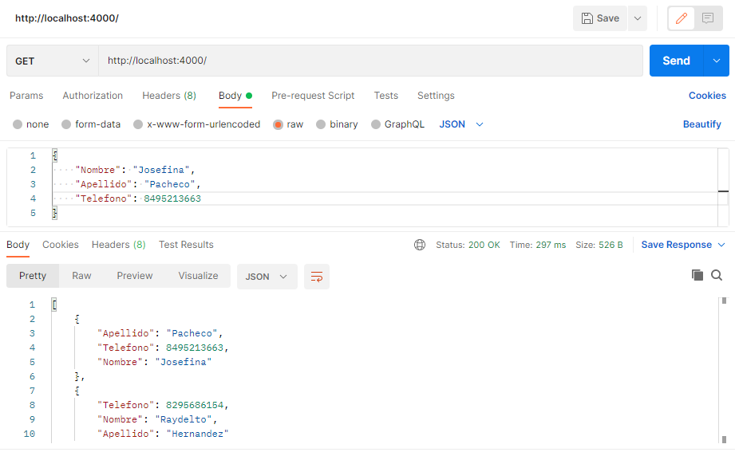
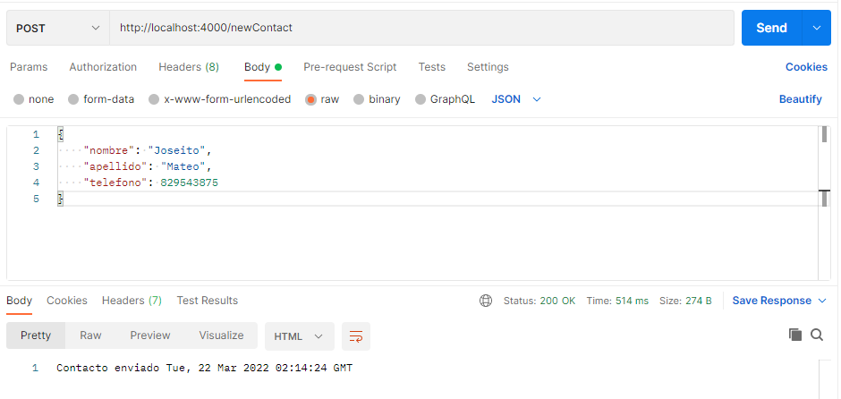

# Express JS server
Example of a simple Express.js Api, allows clients to get a list of contacts from another [web service](http://www.raydelto.org/agenda.php) and add new contacts as well. (The previews below were taken from postman)

#### GET request 

#### POST request 
