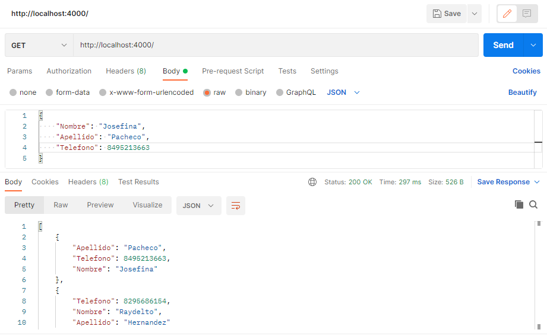
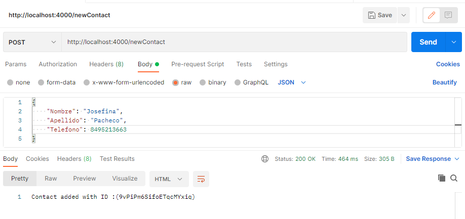
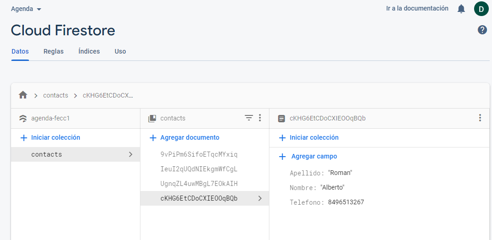

# Express JS server
Example of a simple Express.js Api, allows clients to get a list of contacts from a firebase database and add new contacts as well. (The previews below were taken from postman)

#### GET request 

#### POST request 

#### Firebase collection

